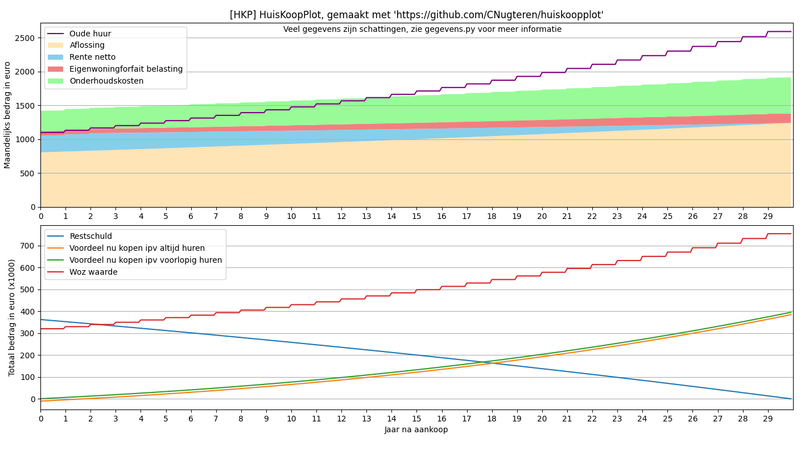

# HuisKoopPlot (HKP): Plot informatie over het financieren van een woning

Een simpele tool om informatie te plotten over de kosten van het financieren van een woning, inclusief hypotheekkosten en andere eenmalige of maandelijkse kosten. De tool zal direct een grafiek plotten, maar slaat alle gegevens ook op als CSV bestand om verder te inspecteren of zelfs grafieken mee te maken.
De tool kan de informatie ook vergelijken met de kosten van het huren.

## Benodigdheden

Om HKP zelf of de tests te draaien zelf te draaien heb je nodig:
* Python 3.7 of nieuwer
* Een aantal Python packages, eenvoudig te installeren via `pip3 install -r requirements.txt`

## Gebruik van de tool

Nadat aan de bovenstaande benodigdheden voldaan is, zijn er drie eenvoudige stappen om de tool te gebruiken:

1. Eerst moet je de gegevens in `gegevens.py` aanpassen naar jouw situatie. De gegevens in dit bestand zijn voorzien van uitleg en zijn grofweg in twee secties verdeeld: een eerste sectie met waarden die vrijwel zeker aangepast worden en een tweede sectie waarin waarden staan die al een redelijke waarde hebben maar aangepast worden voor een nauwkeurige berekening voor de huidige situatie.

2. Als alle gegevens opgeslagen zijn kan je de tool op deze manier draaien: `python3 hkp.py`.

3. De tool zal al allerlei gegevens op het scherm tonen, maar de belangrijkste resultaten zijn opgelagen als twee bestanden:
    1. Een CSV-bestand `hkp.csv` met alle gegegevens per maand. Dit bestand kan bijvoorbeeld ingelezen worden in een spreadsheetprogramma zoals Excel, Calc of Numbers, en van daaruit kunnen naar wens grafieken gemaakt worden.
    2. Een afbeelding `hkp.png` met de geplotte data als twee grafieken: 1 grafiek om een inzicht in de maandelijkse kosten te krijgen en een tweede grafiek om de totale waarden te inspecteren over de tijd. Zie hieronder voor een voorbeeld.
 
 
 ## Voorbeeld
 
Om een idee te krijgen van de tool zijn hier de resultaten voor de gegevens zoals hij standaard ingevuld zijn (aankoopprijs van 400k euro met 50k eigen inleg en een annuiteitenhypotheek).

Voor dit voorbeeld worden de volgende gegevens genomen:

Hieruit wordt [deze CSV](doc/hkp.csv) geproduceerd en de volgende grafiek:

In de bovenste grafiek zijn de maandlasten af te lezen:

1. De **aflossing** op de hypotheek
2. De **netto rente**. Dit is de hypotheekrente minus het belastingvoordeel van de hypotheekrenteaftrek (HRA).
3. Het **eigenwoningforfait**, de te betalen belasting voor woning bezit (EWF). Dit is gebaseerd op de WOZ-waarde, waarbij aangenomen wordt dat die elk jaar met een bepaald percentage stijgt.
4. De **onderhoudskosten** voor grote en kleine zaken (CV ketel onderhoud, vervanging, schilderwerk, dakpannen, lekkages, nieuw sanitair, etc.). Dit zijn de kosten die bij een huurwoning door de eigenaar betaald worden. Deze kosten stijgen met de geschatte inflatie.
5. De **oude huur** kan opgenomen worden ter referentie, deze doet uiteraard niet mee in de berekening van de maandelijkse lasten. Aangenomen wordt dat de huur elk jaar met een bepaald percentage wordt opgehoogd.

In de onderstaande grafiek zijn de totale waarden af te lezen:

1. De restschuld van de hypotheek.
2. Het totale financiele voordeel (of nadeel wanneer negatief) voor het kopen ten opzichte van huren, puur op basis van het verschil in maandlasten waarbij aflossing niet meegerekend wordt. Ook de eventuele daling of stijging van de woning in waarde wordt niet meegerekend.
3. Hetzelfde als hierboven maar nu zonder de eenmalige kosten koper e.d. meegerekend.
4. De geschatte WOZ-waarde, wat wordt gebruikt voor de berekening van het eigenwoningforfait.
